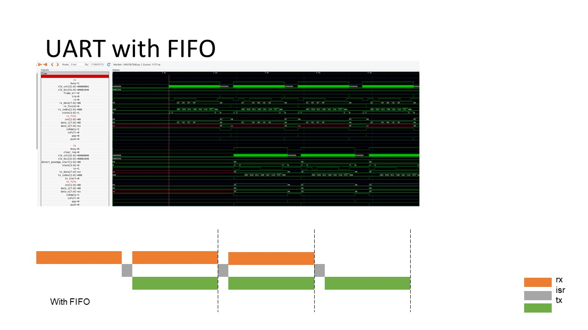

# Caravel SoC UART

## Run iverilog simulation
```sh
cd ~/SoC_UART/testbench/counter_la
source run_sim
```

## Target
- In the original design, the UART in Caravel SoC could not RX/TX concurrently. 
- We need to add FIFO and communicate with CPU through wishbone (WB) protocol to solve this issue.

## Solution





